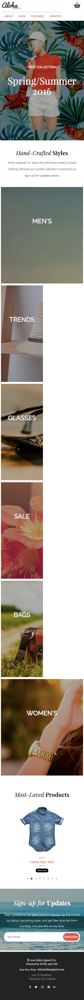
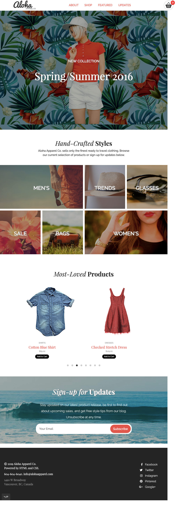

# Aloha Apparel Co. Webpage

This is a webpage for a fictional apparel store to demonstrate and explore the use of HTML, CSS, and JavaScript. The webpage is made responsive for mobile, tablet, and desktop dimensions.

## Instructions:

Simply clone the project and open index.html on any internet browser.

# Technologies Used

* HTML5
* CSS3
* JavaScript
* Flickity
* Transfonter
* Font Awesome

# Personal Learning Developments

* Hours of experimenting with HTML, CSS, and JavaScript contributed to a more solid understanding of how they work together in a webpage.

* Applying responsive web design using Mobile First Approach contributed to smoother transition between small to large dimensions.

* Use of a JavaScript plugin, Flickity, made enabling scrolling effects in featured section easier.

* Use of Transfonter to generate font css from font assets contributed to applying custom fonts to the webpage.

* Use of Font Awesome to apply social media icons.

* Learning to use Git to upload commits enabled better recording of project's progress.

# Screenshots

## Mobile

## Tablet

## Desktop

